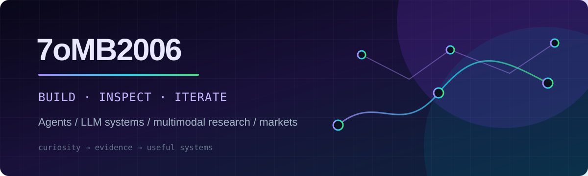

  

  
  
  

## About

> 踽踽而行，步履不停。

我关注 Agent、LLM 应用与系统设计，也在持续探索多模态研究工作流和金融数据分析。比起把模型当作聊天框，我更关心它如何获得证据、调用工具、接受约束，以及在真实系统中稳定运行。

## Selected Work

| Project | What it explores |
| --- | --- |
| [Bilibili Video Research](https://github.com/7oMB2006/Bilibili-Video-Research) | 面向 Bilibili 视频的证据驱动型研究 MCP，结合语言、视觉与多模态证据。 |
| [Daily Stock Analysis](https://github.com/7oMB2006/daily_stock_analysis) | 面向 A 股、港股与美股的 LLM 分析工具：行情、新闻、决策仪表盘与推送。 |
| [Web AI Proxy](https://github.com/7oMB2006/web-ai-proxy) | 基于浏览器插件自动填充方案的 AI 网页代理实验。 |

## Thinking in Public

- **Agents**：工具调用、工作流编排、可观测性与可靠性边界。
- **LLM systems**：上下文、检索、评估，以及把不确定性显式纳入系统设计。
- **Markets**：数据质量、信号与噪声、自动化分析的适用边界。
- **Engineering**：让好奇心沉淀为可复现、可维护的工具。

  

